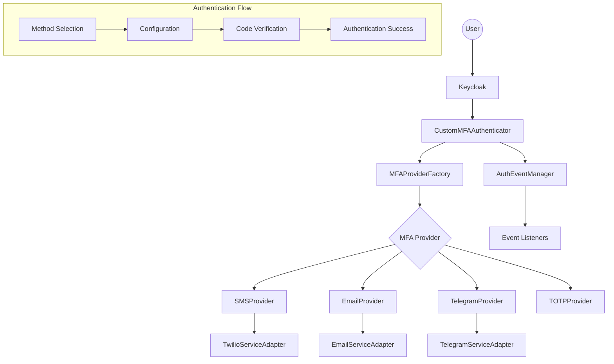
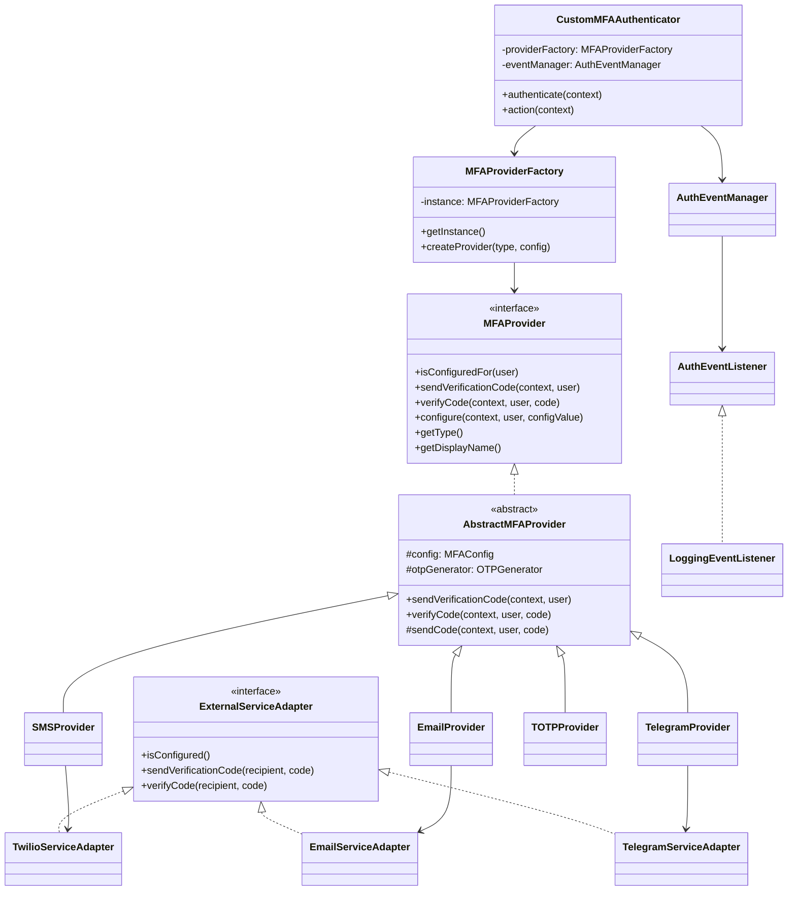

# Keycloak MFA Plugin

This project is a Keycloak authentication plugin that provides multi-factor authentication (MFA) using various methods including SMS, Email, Telegram, and TOTP. The codebase follows modern design patterns, providing an extensible, maintainable, and testable architecture.

## Architecture Overview



## Design Patterns Overview

```mermaid
graph TD
    subgraph Strategy[Strategy Pattern]
        StrategyInterface[MFAProvider Interface]
        StrategyAbstract[AbstractMFAProvider]
        Strategy1[SMSProvider]
        Strategy2[EmailProvider]
        Strategy3[TelegramProvider]
        Strategy4[TOTPProvider]
        
        StrategyInterface --> StrategyAbstract
        StrategyAbstract --> Strategy1
        StrategyAbstract --> Strategy2
        StrategyAbstract --> Strategy3
        StrategyAbstract --> Strategy4
    end
    
    subgraph Factory[Factory Pattern]
        FactoryClass[MFAProviderFactory]
        Client[CustomMFAAuthenticator]
        Product[MFAProvider]
        
        Client --> FactoryClass
        FactoryClass --> Product
    end
    
    subgraph Adapter[Adapter Pattern]
        AdapterInterface[ExternalServiceAdapter]
        Adapter1[TwilioServiceAdapter]
        Adapter2[EmailServiceAdapter]
        Adapter3[TelegramServiceAdapter]
        
        AdapterInterface --> Adapter1
        AdapterInterface --> Adapter2
        AdapterInterface --> Adapter3
    end
    
    subgraph Observer[Observer Pattern]
        Subject[AuthEventManager]
        Observer1[LoggingEventListener]
        ObserverInterface[AuthEventListener]
        EventClass[AuthEvent]
        
        Subject --> ObserverInterface
        ObserverInterface --> Observer1
        Subject --> EventClass
    end
    
    subgraph Template[Template Method]
        TemplateClass[AbstractMFAProvider]
        ConcreteClass[Concrete Providers]
        
        TemplateClass -- "defines flow" --> ConcreteClass
        ConcreteClass -- "override specific steps" --> TemplateClass
    end
    
    subgraph Singleton[Singleton Pattern]
        Single1[OTPGenerator]
        Single2[MFAProviderFactory]
        Single3[AuthEventManager]
        Single4[Service Adapters]
    end
    
    subgraph Builder[Builder Pattern]
        Director[Client Code]
        Builder1[AuthEvent.Builder]
        Builder2[MFAConfig.Builder]
        Builder3[EmailContentBuilder]
        
        Director --> Builder1
        Director --> Builder2
        Director --> Builder3
    end
```



## Class Diagram



## Design Patterns Implemented

### 1. Strategy Pattern

The Strategy Pattern defines a family of algorithms, encapsulates each one, and makes them interchangeable. In this project, it's used to handle different MFA methods:

- **Interface**: `MFAProvider`
- **Abstract Class**: `AbstractMFAProvider`
- **Concrete Implementations**:
  - `SMSProvider`
  - `EmailProvider`
  - `TelegramProvider`
  - `TOTPProvider`

This allows each provider to implement method-specific logic while sharing common functionality through the abstract class.

### 2. Factory Pattern

The Factory Pattern provides an interface for creating objects without specifying their concrete classes. 

- **Factory**: `MFAProviderFactory`

This factory creates the appropriate MFA provider based on the requested type, hiding the instantiation logic from the client code.

### 3. Template Method Pattern

The Template Method Pattern defines the skeleton of an algorithm, deferring some steps to subclasses.

- **Abstract Class**: `AbstractMFAProvider`
- **Template Methods**:
  - `sendVerificationCode()` - Defines the flow for sending codes
  - `verifyCode()` - Defines the flow for verifying codes

This allows consistent handling while letting subclasses implement method-specific steps.

### 4. Singleton Pattern

The Singleton Pattern ensures a class has only one instance and provides a global point to access it.

- **Singleton Classes**:
  - `MFAProviderFactory`
  - `AuthEventManager`
  - `OTPGenerator`
  - Service adapters (TwilioServiceAdapter, TelegramServiceAdapter, EmailServiceAdapter)

This prevents unnecessary creation of objects that should be shared.

### 5. Builder Pattern

The Builder Pattern separates the construction of a complex object from its representation.

- **Builders**:
  - `AuthEvent.Builder`
  - `MFAConfig.Builder`
  - `EmailServiceAdapter.EmailContentBuilder`

This makes object creation clearer and provides a fluent API.

### 6. Adapter Pattern

The Adapter Pattern converts the interface of a class into another interface clients expect.

- **Interface**: `ExternalServiceAdapter`
- **Implementations**:
  - `TwilioServiceAdapter`
  - `TelegramServiceAdapter`
  - `EmailServiceAdapter`

This provides a consistent interface for working with external services.

### 7. Observer Pattern

The Observer Pattern defines a one-to-many dependency between objects so that when one object changes state, all its dependents are notified.

- **Event Class**: `AuthEvent`
- **Event Manager**: `AuthEventManager`
- **Event Listener Interface**: `AuthEventListener`
- **Example Listener**: `LoggingEventListener`

This allows for logging, metrics, and other cross-cutting concerns without cluttering the core code.

## Key Benefits

1. **Extensibility**: Adding new MFA methods is easy - just implement a new provider.
2. **Testability**: The modular design makes unit testing much simpler.
3. **Separation of Concerns**: Each class has a single responsibility.
4. **Code Reuse**: Common logic is shared through abstract classes and utilities.
5. **Maintainability**: The clean architecture makes the code easier to understand and modify.
6. **Error Handling**: Consistent exception handling across components.
7. **Logging**: Centralized logging through events.

## Package Structure

```
com.example.mfa/
├── authenticator/
│   ├── CustomMFAAuthenticator.java       # Main authenticator
│   └── CustomMFAAuthenticatorFactory.java
├── config/
│   └── MFAConfig.java                    # Configuration
├── provider/
│   ├── MFAProvider.java                  # Interface for all providers
│   ├── AbstractMFAProvider.java          # Abstract base class
│   ├── MFAException.java                 # Custom exception
│   ├── SMSProvider.java                  # Implementation for SMS
│   ├── EmailProvider.java                # Implementation for Email
│   ├── TelegramProvider.java             # Implementation for Telegram
│   └── TOTPProvider.java                 # Implementation for TOTP
├── factory/
│   └── MFAProviderFactory.java           # Factory for creating providers
├── service/
│   ├── ExternalServiceAdapter.java       # Interface for external services
│   ├── TwilioServiceAdapter.java         # Implementation for Twilio
│   ├── TelegramServiceAdapter.java       # Implementation for Telegram
│   └── EmailServiceAdapter.java          # Implementation for Email
├── event/
│   ├── AuthEvent.java                    # Event class
│   ├── AuthEventListener.java            # Listener interface
│   ├── AuthEventManager.java             # Event manager
│   └── LoggingEventListener.java         # Example listener
└── util/
    ├── OTPGenerator.java                 # Utility for OTP generation
    └── ValidationUtil.java               # Validation utilities
```

## How to Use

To add a new MFA method:

1. Create a new implementation of `MFAProvider`
2. Add the new method type to the `MFAProviderFactory`
3. Update the UI templates if necessary

The main authenticator doesn't need to be modified when adding new methods, as it delegates to the appropriate provider through the factory.