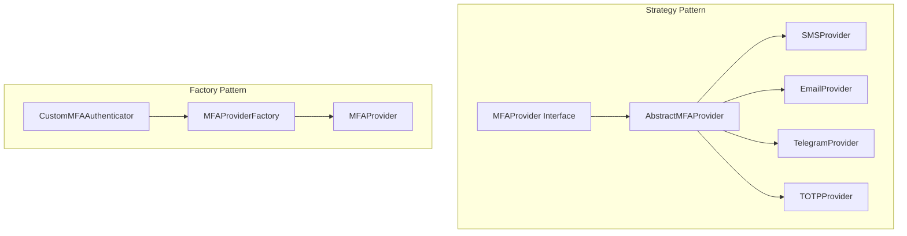
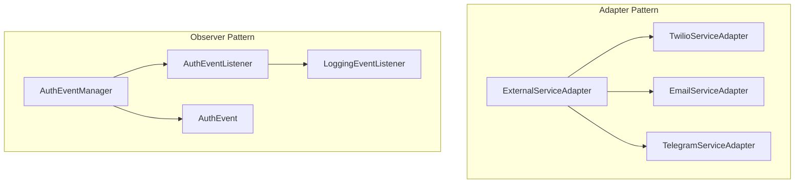
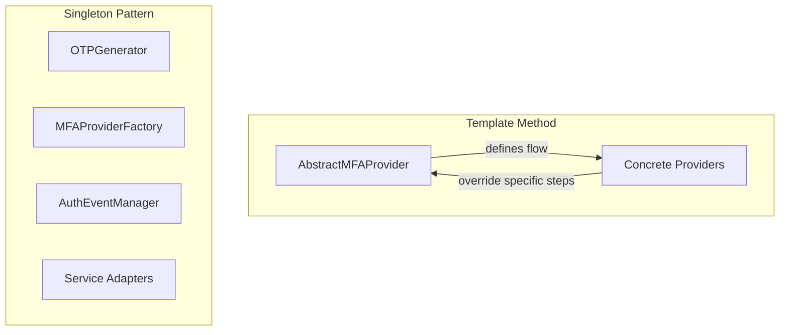

# Keycloak Multi-MFA

This project is a Keycloak authentication plugin that provides multi-factor authentication (MFA) using various methods including SMS, Email, Telegram, and TOTP. The codebase follows modern design patterns, providing an extensible, maintainable, and testable architecture.

## Compatibility

- Supports Keycloak version 26.x and above
- Built with Java 11+
- Tested with PostgreSQL as the database backend

## Integration Guide

### Building the Plugin

1. Clone the repository
2. Build using Maven:
   ```bash
   mvn clean package
   ```
3. The build will produce a JAR file in the `target` directory

### Installation

1. Copy the JAR file to the Keycloak `providers` directory:

   ```bash
   cp target/keycloak-mfa-plugin-1.0-SNAPSHOT.jar /path/to/keycloak/providers/
   ```
2. Restart Keycloak or build a new image if using Docker:

   ```bash
   # For standalone Keycloak
   /path/to/keycloak/bin/kc.sh build
   /path/to/keycloak/bin/kc.sh start-dev

   # For Docker-based setup
   docker-compose -f docker/docker-compose.yml up --build
   ```

### Accessing Keycloak UI

After deploying Keycloak, you can access the login console:

- **URL**: http://localhost:3220/auth/ (The port may vary based on your `docker-compose.yml` configuration)
- **Default credentials**:
  - Username: `admin`
  - Password: `admin`

### Configuration

1. Log in to the Keycloak at http://localhost:3220/auth/
2. Go to Authentication → Flows
3. Duplicate the "Browser" flow or create a new flow
4. Add the "Custom MFA Authentication" as an execution step
5. Click the gear icon on the new execution to configure it:

   - Twilio Account SID, Auth Token, and Verify Service SID for SMS
   - Telegram Bot Token for Telegram notifications
   - Email settings (uses Keycloak's email configuration by default)
   - OTP expiration time
6. Set the flow as "Required" or "Alternative" based on your needs
7. Bind the new flow to your realm's browser flow

## Setting Up the Telegram Bot

The MFA plugin includes a Telegram bot service that allows users to receive one-time passwords via Telegram.

### Creating a Telegram Bot

1. Open Telegram and search for "BotFather" (@BotFather)
2. Start a chat with BotFather and send the `/newbot` command
3. Follow the instructions to create a new bot:
   - Provide a name for your bot (e.g., "MFA OTP Bot")
   - Provide a username for your bot (e.g., "mfa_otp_bot")
4. Once created, BotFather will provide you with a token. This token is required for the bot to function.

Example:

```
Use this token to access the HTTP API:
123456789:ABCDefGhIJKlmnOPQRstUVwxyz
```

### Configuring the Docker Environment

```
export TELEGRAM_BOT_TOKEN=123456789:ABCDefGhIJKlmnOPQRstUVwxyz
```

### Updating the Bot Username in Keycloak

The bot username is configured in the `messages_en.properties` file. The default setting is `@KeycloakMultiMFA`, but you should update this to match your actual bot username:

1. Open `src/main/resources/theme/base/login/messages/messages_en.properties`
2. Find the line with `telegrambotusername=` and update it with your bot's username
3. Rebuild and redeploy the Keycloak service for the changes to take effect

### User Experience with Telegram MFA

When users select Telegram as their MFA method, they will:

1. Be prompted to contact the Telegram bot
2. The bot will respond with their Chat ID
3. Users enter this Chat ID in the MFA configuration screen
4. For future logins, the system will send one-time codes to the user via the Telegram bot

## Docker Deployment

A Docker Compose file is included for easy deployment with support for all services including the Telegram bot:

```bash
# Start the environment
docker-compose -f docker/docker-compose.yml up --build

# View logs
docker-compose logs -f

# Stop the environment
docker-compose down
```

The Docker setup includes:

- Keycloak server with the MFA plugin pre-installed
- PostgreSQL database
- Telegram bot service for MFA via Telegram
- Proper configuration for all services

### Testing

You can test the MFA functionality by:

1. Creating a user in the realm through the Keycloak Admin Console
2. Enabling MFA for the user through the user account
3. Navigating to the login page at http://localhost:3220/
4. Logging in with the user's credentials
5. Selecting an MFA method and configuring it if necessary
6. Verifying the authentication with the selected method

## Architecture Overview


## Design Patterns Overview







## Class Diagram


## Design Patterns Implemented

### 1. Strategy Pattern

The Strategy Pattern defines a family of algorithms, encapsulates each one, and makes them interchangeable. In this project, it's used to handle different MFA methods:

- **Interface**: `MFAProvider`
- **Abstract Class**: `AbstractMFAProvider`
- **Concrete Implementations**:
  - `SMSProvider`
  - `EmailProvider`
  - `TelegramProvider`
  - `TOTPProvider`

This allows each provider to implement method-specific logic while sharing common functionality through the abstract class.

### 2. Factory Pattern

The Factory Pattern provides an interface for creating objects without specifying their concrete classes.

- **Factory**: `MFAProviderFactory`

This factory creates the appropriate MFA provider based on the requested type, hiding the instantiation logic from the client code.

### 3. Template Method Pattern

The Template Method Pattern defines the skeleton of an algorithm, deferring some steps to subclasses.

- **Abstract Class**: `AbstractMFAProvider`
- **Template Methods**:
  - `sendVerificationCode()` - Defines the flow for sending codes
  - `verifyCode()` - Defines the flow for verifying codes

This allows consistent handling while letting subclasses implement method-specific steps.

### 4. Singleton Pattern

The Singleton Pattern ensures a class has only one instance and provides a global point to access it.

- **Singleton Classes**:
  - `MFAProviderFactory`
  - `AuthEventManager`
  - `OTPGenerator`
  - Service adapters (TwilioServiceAdapter, TelegramServiceAdapter, EmailServiceAdapter)

This prevents unnecessary creation of objects that should be shared.

### 5.Adapter Pattern

The Adapter Pattern converts the interface of a class into another interface clients expect.

- **Interface**: `ExternalServiceAdapter`
- **Implementations**:
  - `TwilioServiceAdapter`
  - `TelegramServiceAdapter`
  - `EmailServiceAdapter`

This provides a consistent interface for working with external services.

### 6. Observer Pattern

The Observer Pattern defines a one-to-many dependency between objects so that when one object changes state, all its dependents are notified.

- **Event Class**: `AuthEvent`
- **Event Manager**: `AuthEventManager`
- **Event Listener Interface**: `AuthEventListener`
- **Example Listener**: `LoggingEventListener`

This allows for logging, metrics, and other cross-cutting concerns without cluttering the core code.

## Telegram Bot Structure

The Telegram bot service is organized as follows:

```
docker/telegram-bot/
├── Dockerfile           # Container configuration for the bot
├── package.json         # Node.js dependencies
└── bot.js               # Bot implementation
```

## Key Benefits

1. **Extensibility**: Adding new MFA methods is easy - just implement a new provider.
2. **Testability**: The modular design makes unit testing much simpler.
3. **Separation of Concerns**: Each class has a single responsibility.
4. **Code Reuse**: Common logic is shared through abstract classes and utilities.
5. **Maintainability**: The clean architecture makes the code easier to understand and modify.
6. **Error Handling**: Consistent exception handling across components.
7. **Logging**: Centralized logging through events.

## Package Structure

```
com.example.mfa/
├── authenticator/
│   ├── CustomMFAAuthenticator.java       # Main authenticator
│   └── CustomMFAAuthenticatorFactory.java
├── config/
│   └── MFAConfig.java                    # Configuration
├── provider/
│   ├── MFAProvider.java                  # Interface for all providers
│   ├── AbstractMFAProvider.java          # Abstract base class
│   ├── MFAException.java                 # Custom exception
│   ├── SMSProvider.java                  # Implementation for SMS
│   ├── EmailProvider.java                # Implementation for Email
│   ├── TelegramProvider.java             # Implementation for Telegram
│   └── TOTPProvider.java                 # Implementation for TOTP
├── factory/
│   └── MFAProviderFactory.java           # Factory for creating providers
├── service/
│   ├── ExternalServiceAdapter.java       # Interface for external services
│   ├── TwilioServiceAdapter.java         # Implementation for Twilio
│   ├── TelegramServiceAdapter.java       # Implementation for Telegram
│   └── EmailServiceAdapter.java          # Implementation for Email
├── event/
│   ├── AuthEvent.java                    # Event class
│   ├── AuthEventListener.java            # Listener interface
│   ├── AuthEventManager.java             # Event manager
│   └── LoggingEventListener.java         # Example listener
└── util/
    ├── OTPGenerator.java                 # Utility for OTP generation
    └── ValidationUtil.java               # Validation utilities
```

## How to Use

To add a new MFA method:

1. Create a new implementation of `MFAProvider`
2. Add the new method type to the `MFAProviderFactory`
3. Update the UI templates if necessary

The main authenticator doesn't need to be modified when adding new methods, as it delegates to the appropriate provider through the factory.

## Requirements

### Twilio (for SMS authentication)

- Twilio account with Account SID and Auth Token
- Twilio Verify Service set up with SMS capability
- Twilio Verify Service SID

### Telegram (for Telegram authentication)

- Telegram Bot created through BotFather
- Telegram Bot Token
- Users will need to message the bot to get their Chat ID

### Email (for Email authentication)

- Working SMTP configuration in Keycloak
- Or custom SMTP configuration provided to the plugin

### TOTP (for Authenticator App)

- Uses Keycloak's built-in TOTP implementation
- Users will need an authenticator app like Google Authenticator, Microsoft Authenticator, or Authy

## Troubleshooting

### Configuration Issues

- If MFA methods stay in "development mode" despite configuration:
  - Check that the exact key names match between the factory and adapters
  - Verify authentication flow configuration in Keycloak
  - Enable DEBUG logging for detailed configuration tracing

### TOTP Configuration

- If users aren't redirected to TOTP setup:
  - Ensure the CONFIGURE_TOTP required action is enabled in your realm
  - Check that TOTP is properly set up in the authentication flow

### Email Delivery Issues

- Verify Keycloak's email configuration is working
- Test email sending through Keycloak's test feature
- Check spam folders for MFA verification emails

### Telegram Bot Issues

- **Bot doesn't respond**: Check that the `TELEGRAM_BOT_TOKEN` is correctly set in the `.env` file
- **Connection errors**: Ensure that your server can reach the Telegram API (api.telegram.org)
- **Users can't find the bot**: Verify that the username in `messages_en.properties` matches the actual bot username

### Keycloak UI Access Issues

- If you can't access the Keycloak UI at http://localhost:3220/:
  - Verify that the Keycloak container is running (`docker ps`)
  - Check container logs for startup errors (`docker logs keycloak`)
  - Confirm port mapping in your docker-compose.yml matches the URL you're trying to access

### Logging

- Enable DEBUG level logging for `com.example.mfa` package
- Examine `AuthEvent` logs for authentication flow issues
- Service adapters log connection and delivery attempts

### Common Errors

- "Configuration error occurred": Check service credentials
- "Verification session has expired": Increase OTP timeout
- "Failed to send verification code": Check service connectivity
- "Invalid verification code": Ensure clock synchronization for TOTP

## Security Considerations

- The Telegram bot token and Twilio credentials are sensitive. Protect them as you would any API key.
- In production environments, consider using a secrets management solution rather than environment variables in a `.env` file.
- The Telegram bot is public and can be messaged by anyone. It only returns Chat IDs and does not expose any sensitive information.
- OTP codes expire after a configurable timeout period (default 5 minutes)
- Failed verification attempts are limited to prevent brute force attacks
